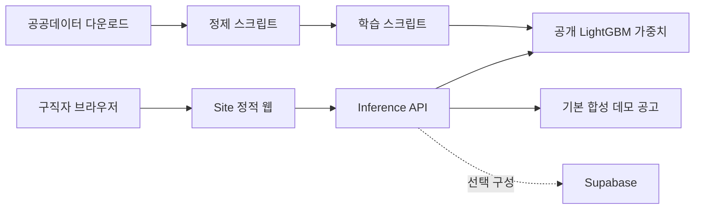

# JobBridge

> 장애인 구직자가 자신의 조건과 필요를 설명하고, 접근성 정보를 함께 보며 일자리를 탐색하도록 돕는 오픈소스 취업 탐색 서비스

[서비스 데모](https://jobbridge-site.vercel.app) · [데이터·모델 명세](docs/DATA_SOURCES_AND_LICENSES.md) · [재현 가이드](docs/REPRODUCIBILITY.md) · [모델 카드](Models/lightgbm_jobseeker_preference_v1/MODEL_CARD.md)

## 해결하려는 문제

채용공고가 많아도 장애인 구직자에게 필요한 정보는 흩어져 있습니다. 근무 지역과 임금뿐 아니라 이동·의사소통·작업환경과 같은 조건을 함께 확인해야 하며, 개인의 장애유형만으로 직무 적합성을 단정해서도 안 됩니다. JobBridge는 다음 원칙으로 이 탐색 비용을 줄입니다.

- 사용자가 입력한 희망 직무와 임금, 지역을 최우선으로 반영합니다.
- 공개 모델은 과거 구직자의 **희망직종 분포**를 보조 신호로만 사용합니다.
- 모델 결과를 취업 성공 가능성이나 개인의 능력 판정으로 표현하지 않습니다.
- 추천 근거와 주의 조건을 함께 보여 주고 최종 선택권을 사용자에게 둡니다.
- 기본 공개 실행은 실제 사람이 아닌 합성 채용공고로 동작합니다.

## 주요 기능

- 장애유형·중증도·연령·지역과 사용자 선호를 분리한 프로필 입력
- LightGBM 기반 직무 선호 사전분포와 명시적 희망조건의 결합
- 채용공고의 임금·지역·근무환경·접근성 단서 비교
- 추천 근거와 주의 요인을 포함한 설명 가능한 결과
- Supabase 기반 회원·추천 기록·공고 동기화의 선택적 서버 구성
- 정적 웹, Python HTTP 서버, AWS Lambda 실행 경로

## 구조



## 5분 실행

Windows PowerShell 기준입니다. Python 3.10 이상을 권장합니다.

```powershell
git clone https://github.com/freeboxwork/JobBridge-OSS.git
cd JobBridge-OSS
python -m venv .venv
.\.venv\Scripts\Activate.ps1
python -m pip install -r requirements.txt
$env:PYTHONPATH="$PWD\Services\jobbridge_inference"
python -m jobbridge_inference.http_server --host 127.0.0.1 --port 8787
```

브라우저에서 `http://127.0.0.1:8787/JobBridge.dc.html`을 엽니다. 공개 모델 가중치와 `Data/demo` 합성 데이터가 포함되어 있어 별도 키 없이 실행됩니다.

헬스 체크:

```powershell
Invoke-RestMethod http://127.0.0.1:8787/health
```

추천 API:

```powershell
$body = @{
  modelFeatures = @{
    sido = "경기"; sigungu = "수원시"; age = 32
    disability_type = "청각장애"; severity = "경증"
  }
  scoringPreferences = @{
    desired_job_class = "경영·행정·사무직"
    desired_wage = "월 220~260만원"
  }
} | ConvertTo-Json -Depth 4

Invoke-RestMethod http://127.0.0.1:8787/v1/recommendations `
  -Method Post -ContentType "application/json" -Body $body
```

## 공개 모델

`lightgbm_jobseeker_preference_v1`은 한국장애인고용공단의 공공누리 제1유형 구직자 현황에서 **구직자가 등록한 희망직종 대분류**를 학습한 보조 모델입니다. 취업 성과를 학습한 모델이 아니며 적성·능력·채용 가능성을 판단하지 않습니다.

| 항목 | 값 |
|---|---:|
| 학습 행 | 41,719 |
| 평가 행 | 8,344 |
| 직무 분류 | 28 |
| Top-1 정확도 | 0.2604 |
| Top-3 정확도 | 0.5585 |
| Top-5 정확도 | 0.7270 |

모델의 낮은 Top-1 성능과 편향 위험을 숨기지 않습니다. 명시적 사용자 선호가 항상 모델보다 우선하며, 자세한 제한은 [모델 카드](Models/lightgbm_jobseeker_preference_v1/MODEL_CARD.md)에 기록했습니다.

## 데이터와 라이선스

- 공개 가중치는 상업 이용이 허용되는 **공공누리 제1유형** 구직자 데이터만 사용했습니다.
- 공공누리 제2유형인 취업성공·구인정보 원본과 이를 학습한 기존 가중치는 이 저장소에서 제외했습니다.
- 원본 행 단위 구직자 데이터도 개인정보 최소화 원칙에 따라 커밋하지 않습니다. 공식 파일을 직접 내려받아 재현할 수 있습니다.
- 모든 외부 데이터와 소프트웨어의 출처·이용조건은 [데이터 출처와 라이선스](docs/DATA_SOURCES_AND_LICENSES.md) 및 [제3자 고지](THIRD_PARTY_NOTICES.md)에 정리했습니다.

## 저장소 구성

```text
Data/demo/                    합성 실행 데이터
Models/                       공개 모델 가중치·지표·모델 카드
Scripts/                      수집·정제·학습·동기화 코드
Services/jobbridge_inference/ 추론 HTTP/Lambda 서비스
Services/jobbridge_live_jobs/ 선택형 실시간 공고 Lambda
Site/                         접근성 중심 웹 UI와 Vercel API
supabase/                     RLS·테이블 SQL
tests/                        공개본 회귀 테스트
docs/                         아키텍처·재현·라이선스·공모전 문서
```

## 보안과 개인정보

`.env`는 커밋하지 마세요. Supabase service-role 키와 공공데이터 API 키는 서버에서만 사용해야 합니다. 추천 요청 저장은 기본적으로 꺼져 있습니다. 취약점 신고는 [SECURITY.md](SECURITY.md), 개인정보 처리 원칙은 [PRIVACY.md](PRIVACY.md)를 확인하세요.

## 기여

[CONTRIBUTING.md](CONTRIBUTING.md)와 [CODE_OF_CONDUCT.md](CODE_OF_CONDUCT.md)를 따라 이슈와 Pull Request를 보내 주세요. 특히 장애 당사자의 피드백, 접근성 QA, 설명 가능성 개선을 환영합니다.

## 라이선스

참가자가 작성한 코드와 공개 모델 가중치는 [Apache License 2.0](LICENSE)으로 배포합니다. 외부 데이터는 각 원저작자의 조건을 따르며 Apache-2.0으로 재허가되지 않습니다.
