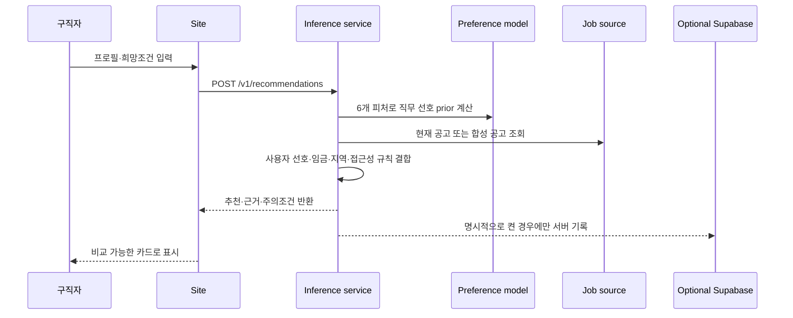

# 아키텍처

## 실행 경로

## 신뢰 경계

- 브라우저에는 publishable/anon 키만 둘 수 있습니다.
- Supabase service-role 키와 공공 API 키는 서버 환경변수로만 전달합니다.
- `JOBBRIDGE_RECOMMENDATION_LOGGING_ENABLED` 기본값은 `false`입니다.
- 공개 데모는 제3자 데이터 없이 `Data/demo`로 실행됩니다.
- 실제 공고는 만료일·활성 상태를 서버에서 다시 검사합니다.

## 추천 점수의 우선순위

1. 사용자가 명시한 희망 직무·임금
2. 지역과 현재 공고 조건
3. 접근성·작업환경의 주의/지원 단서
4. 공개 선호 모델의 확률과 시장 prior

장애유형 규칙은 특정 직업을 차단하는 자동 의사결정이 아니라 설명용 주의 신호입니다. 사용자는 결과를 변경하고 다른 직무를 탐색할 수 있어야 합니다.

## 배포 단위

- `Site`: 정적 웹과 최소 Vercel 서버 함수
- `jobbridge_inference`: 표준 라이브러리 HTTP 서버 또는 Lambda handler
- `jobbridge_live_jobs`: 선택형 공고 읽기·동기화 Lambda
- `supabase`: 사용자 프로필·추천·공고·역량 카탈로그 SQL
